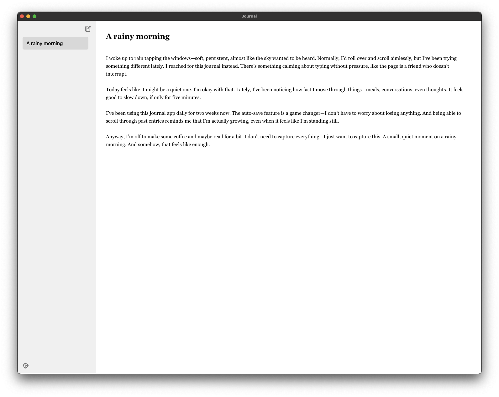

# Journal
<p align="center">
  
</p

A lightweight journaling app for macOS, built with privacy as its core principle. No cloud. No syncing. No sharing. Just your thoughts stored locally, and seen by no one but you. A calm, focused writing experience made just for your Mac.

## Features
<p align="center">
  
</p

* **Backups the old fashioned way**: Your journal data is stored in `~/Library/Application Support/Journal/journal.db`. You can export this to your Downloads folder in Settings to save to an external hard drive or import old journal entries to view in your Journal.
* **Ctrl + b**: Blur your screen when it's not in use. Also blurs automatically after a minute of non-use. Click to dismiss or hit Crtl+b again.
* **Dark mode**: Toggleable in Settings between System, Light, and Dark.
* **Encryption at rest**: AES-256 encryption on your local journal entries database.
* **Markdown-style editing!** Bold, italicize, create bulleted lists, and more.

## Running locally
1. **Make sure you have Rust and the Tauri CLI installed**
```bash
curl --proto '=https' --tlsv1.2 -sSf https://sh.rustup.rs | sh
cargo install create-tauri-app
```
2. **Clone the repository**
```bash
git clone https://github.com/nickrroberts/journal.git
cd journal
```
3. **Install dependencies**
```bash
npm install
```
4. **Start the development server**
```bash
npm run tauri dev
```
## A few other notes/ FYI
* You'll need an Apple developer account to actually publish a `.dmg` that will work on other people's computers.
* Tauri runs in an Apple webview. Read more about the architecture [here](https://v2.tauri.app/concept/architecture/) 
* Please feel free to shoot a PR my way if you find Journal useful and you'd like to contribute!

   
